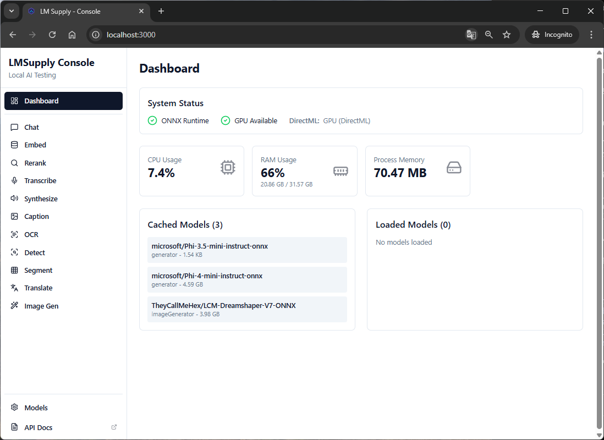
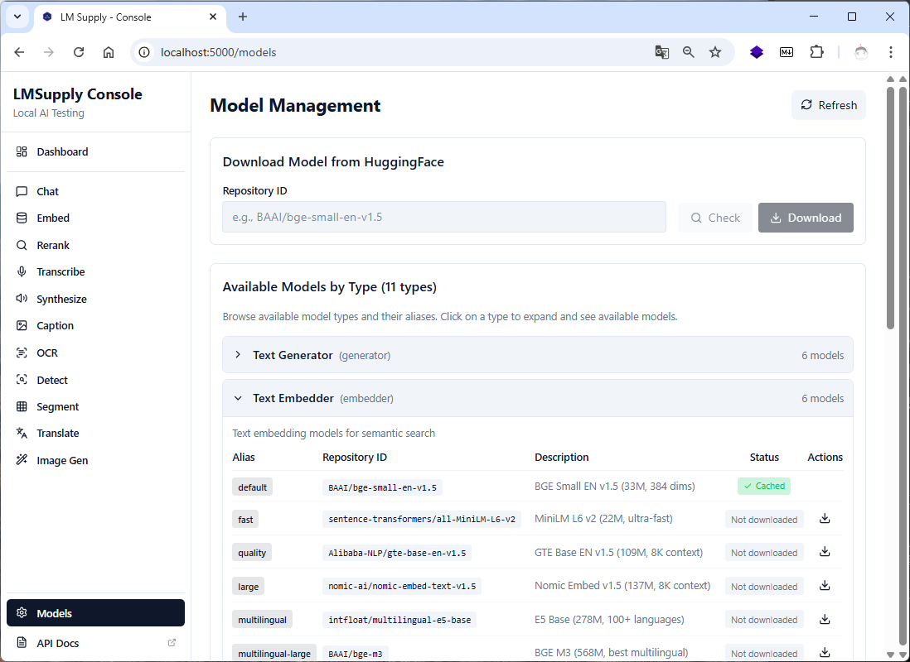
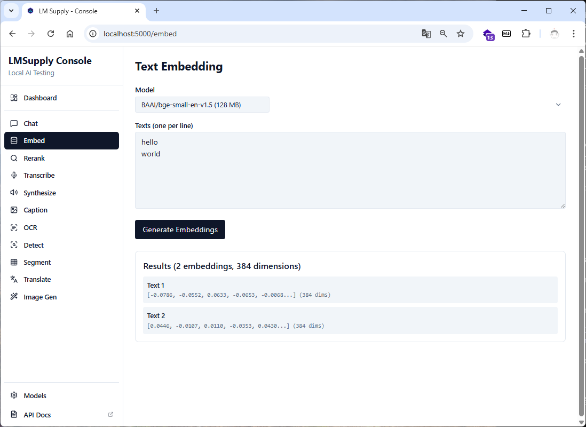
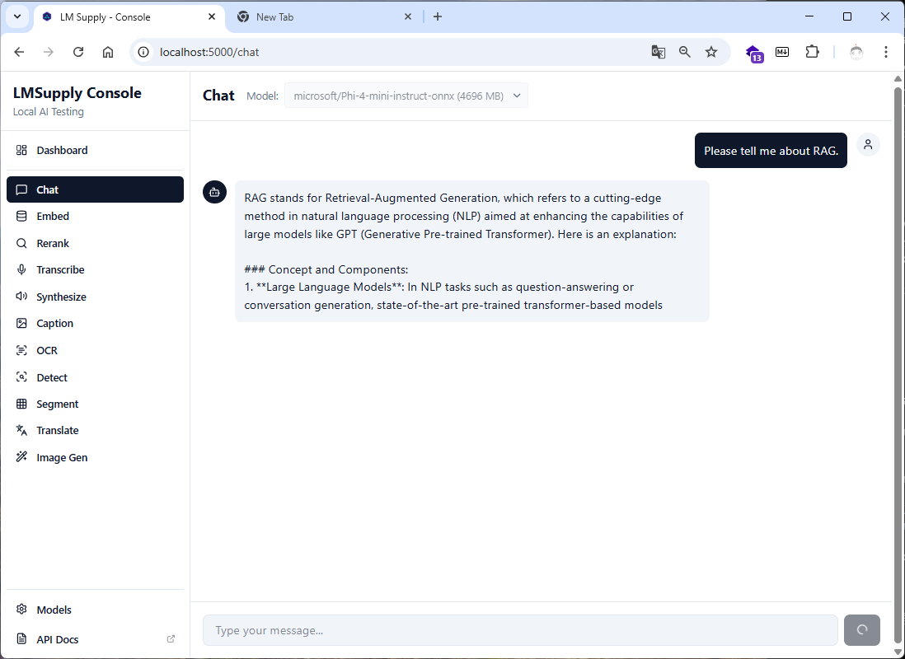

# LMSupply

**Local Model Supply for .NET — on-demand AI inference**

[](https://github.com/iyulab/lm-supply/actions/workflows/ci.yml)
[](https://opensource.org/licenses/MIT)

<p align="center">
  
  
</p>
<p align="center">
  
  
</p>

> Start small. Download what you need. Run locally.

```csharp
// This is all you need. No setup. No configuration. No API keys.
await using var model = await LocalEmbedder.LoadAsync("auto");  // Hardware-optimized selection
float[] embedding = await model.EmbedAsync("Hello, world!");
```

LMSupply is designed around three core principles:

### 🪶 Minimal Footprint
Your application ships with **zero bundled models**. The base package is tiny. Models, tokenizers, and runtime components are downloaded **only when first requested** and cached for reuse.

### ⚡ Lazy Everything
```
First run:  LoadAsync("default") → Downloads model → Caches → Runs inference
Next runs:  LoadAsync("default") → Uses cached model → Runs inference instantly
```
No pre-download scripts. No model management. Just use it.

### 🎯 Zero Boilerplate
Traditional approach:
```csharp
// ❌ Without LMSupply: 50+ lines of setup
var tokenizer = LoadTokenizer(modelPath);
var session = new InferenceSession(modelPath, sessionOptions);
var inputIds = tokenizer.Encode(text);
var attentionMask = CreateAttentionMask(inputIds);
var inputs = new List<NamedOnnxValue> { ... };
var outputs = session.Run(inputs);
var embeddings = PostProcess(outputs);
// ... error handling, pooling, normalization, cleanup ...
```

```csharp
// ✅ With LMSupply: 2 lines
await using var model = await LocalEmbedder.LoadAsync("default");
float[] embedding = await model.EmbedAsync("Hello, world!");
```

---

## Packages

| Package | Description | Status |
|---------|-------------|--------|
| [LMSupply.Embedder](docs/embedder.md) | Text → Vector embeddings (ONNX + GGUF) | [](https://www.nuget.org/packages/LMSupply.Embedder) |
| [LMSupply.Reranker](docs/reranker.md) | Semantic reranking for search | [](https://www.nuget.org/packages/LMSupply.Reranker) |
| [LMSupply.Generator](docs/generator.md) | Text generation & chat (ONNX + GGUF) | [](https://www.nuget.org/packages/LMSupply.Generator) |
| [LMSupply.Captioner](docs/captioner.md) | Image → Text captioning | [](https://www.nuget.org/packages/LMSupply.Captioner) |
| [LMSupply.Ocr](docs/ocr.md) | Document OCR | [](https://www.nuget.org/packages/LMSupply.Ocr) |
| [LMSupply.Detector](docs/detector.md) | Object detection | [](https://www.nuget.org/packages/LMSupply.Detector) |
| [LMSupply.Segmenter](docs/segmenter.md) | Image segmentation | [](https://www.nuget.org/packages/LMSupply.Segmenter) |
| [LMSupply.Translator](docs/translator.md) | Neural machine translation | [](https://www.nuget.org/packages/LMSupply.Translator) |
| [LMSupply.Transcriber](docs/transcriber.md) | Speech → Text (Whisper) | [](https://www.nuget.org/packages/LMSupply.Transcriber) |
| [LMSupply.Synthesizer](docs/synthesizer.md) | Text → Speech (Piper) | [](https://www.nuget.org/packages/LMSupply.Synthesizer) |
| [LMSupply.Llama](docs/llama.md) | Shared llama-server management for GGUF | [](https://www.nuget.org/packages/LMSupply.Llama) |

---

## Quick Start

### Text Embeddings

```csharp
using LMSupply.Embedder;

// Use "auto" for hardware-optimized model selection
await using var model = await LocalEmbedder.LoadAsync("auto");

// Single text
float[] embedding = await model.EmbedAsync("Hello, world!");

// Batch processing
float[][] embeddings = await model.EmbedAsync(new[]
{
    "First document",
    "Second document",
    "Third document"
});

// Similarity
float similarity = LocalEmbedder.CosineSimilarity(embeddings[0], embeddings[1]);

// GGUF models (via llama-server) - Auto-detected by repo name pattern
await using var ggufModel = await LocalEmbedder.LoadAsync("nomic-ai/nomic-embed-text-v1.5-GGUF");
float[] ggufEmbedding = await ggufModel.EmbedAsync("Hello from GGUF!");
```

### Semantic Reranking

```csharp
using LMSupply.Reranker;

await using var reranker = await LocalReranker.LoadAsync("default");

var results = await reranker.RerankAsync(
    query: "What is machine learning?",
    documents: new[]
    {
        "Machine learning is a subset of artificial intelligence...",
        "The weather today is sunny and warm...",
        "Deep learning uses neural networks..."
    },
    topK: 2
);

foreach (var result in results)
{
    Console.WriteLine($"[{result.Score:F4}] {result.Document}");
}
```

### Text Generation

```csharp
using LMSupply.Generator;

// GGUF models — native tool calling support via llama-server
await using var model = await LocalGenerator.LoadAsync("gguf:auto");  // Hardware-optimized (Qwen3 pool)

await foreach (var token in model.GenerateAsync("Hello, my name is"))
{
    Console.Write(token);
}

// Chat with tool calling support (--jinja enabled)
var messages = new[]
{
    ChatMessage.System("You are a helpful assistant."),
    ChatMessage.User("Explain quantum computing simply.")
};

await foreach (var token in model.GenerateChatAsync(messages))
{
    Console.Write(token);
}

// ONNX models (for DirectML/NPU environments)
var generator = await TextGeneratorBuilder.Create()
    .WithDefaultModel()  // Platform-aware: Gemma 4 GGUF on NVIDIA/CPU/Mac/Linux, Phi-4 Mini ONNX on DirectML+non-NVIDIA
    .BuildAsync();

string response = await generator.GenerateCompleteAsync("What is machine learning?");

// Fallback chain — try candidates in order, load first that succeeds
await using var robust = await LocalGenerator.LoadWithFallbackChainAsync(
    ["gguf:phi-4-mini", "gguf:qwen3-default"],
    onFailure: (id, ex) => Console.WriteLine($"Skipped {id}: {ex.Message}"));

// Quality floor — prefer a specific model in 'auto' selection, fall back if unavailable
var options = new GeneratorOptions { PreferredAutoModelId = "gguf:phi-4-mini" };
await using var preferred = await LocalGenerator.LoadAsync("auto", options);
```

### Translation

```csharp
using LMSupply.Translator;

await using var translator = await LocalTranslator.LoadAsync("ko-en");

// Translate Korean to English
string english = await translator.TranslateAsync("안녕하세요, 세계!");
Console.WriteLine(english); // "Hello, world!"

// Batch translation
string[] translations = await translator.TranslateBatchAsync(new[]
{
    "첫 번째 문장입니다.",
    "두 번째 문장입니다."
});
```

### Speech Recognition (Transcriber)

```csharp
using LMSupply.Transcriber;

await using var transcriber = await LocalTranscriber.LoadAsync("default");

// Transcribe audio file
var result = await transcriber.TranscribeAsync("audio.wav");
Console.WriteLine(result.Text);
Console.WriteLine($"Language: {result.Language}");

// Streaming transcription
await foreach (var segment in transcriber.TranscribeStreamingAsync("audio.wav"))
{
    Console.WriteLine($"[{segment.Start:F2}s] {segment.Text}");
}
```

### Text-to-Speech (Synthesizer)

```csharp
using LMSupply.Synthesizer;

await using var synthesizer = await LocalSynthesizer.LoadAsync("default");

// Synthesize and save to file
await synthesizer.SynthesizeToFileAsync("Hello, world!", "output.wav");

// Get audio samples
var result = await synthesizer.SynthesizeAsync("Hello!");
Console.WriteLine($"Duration: {result.DurationSeconds:F2}s");
Console.WriteLine($"Real-time factor: {result.RealTimeFactor:F1}x");
```

---

## Available Models

*Updated: 2026-03 based on MTEB leaderboard and community benchmarks*

### Embedder (ONNX)

| Alias | Model | Dims | Params | Context | Best For |
|-------|-------|------|--------|---------|----------|
| `default` | bge-m3 | 1024 | 568M | 8192 | SOTA multilingual, 100+ languages (v0.34+) |
| `quality` | bge-m3 | 1024 | 568M | 8192 | Same as `default`; for pipelines that pin quality tier |
| `fast` | multilingual-e5-small | 384 | 118M | 512 | Lightweight multilingual, low latency |
| `large` | multilingual-e5-large | 1024 | 560M | 512 | Highest dense quality, 100+ languages |

### Embedder (GGUF via llama-server)

GGUF models are auto-detected by `-GGUF` or `_gguf` in repo name, or `.gguf` file extension.

| Model Repository | Dims | Context | Best For |
|------------------|------|---------|----------|
| `nomic-ai/nomic-embed-text-v1.5-GGUF` | 768 | 8K | Long context, matryoshka |
| `BAAI/bge-small-en-v1.5-GGUF` | 384 | 512 | Compact and fast |
| `BAAI/bge-base-en-v1.5-GGUF` | 768 | 512 | Quality balance |
| Any HuggingFace GGUF embedding repo | varies | varies | Custom models |

### Reranker (ONNX)

| Alias | Model | Params | Context | Best For |
|-------|-------|--------|---------|----------|
| `default` | ms-marco-MiniLM-L-6-v2 | 22M | 512 | Balanced speed/quality |
| `fast` | ms-marco-TinyBERT-L-2-v2 | 4.4M | 512 | Ultra-low latency |
| `quality` | bge-reranker-base | 278M | 512 | Higher accuracy |
| `large` | bge-reranker-large | 560M | 512 | Best accuracy |
| `multilingual` | bge-reranker-v2-m3 | 568M | 8192 | Long docs, 100+ languages |

### Reranker (GGUF via llama-server)

GGUF reranker models are auto-detected by `-GGUF` or `_gguf` in repo name.

| Model Repository | Context | Best For |
|------------------|---------|----------|
| `BAAI/bge-reranker-v2-m3-GGUF` | 8K | Multilingual, long docs |
| `jinaai/jina-reranker-v2-base-multilingual-GGUF` | 8K | Multilingual |

### Generator

**Platform-based defaults** (`default` and `auto` delegate to this matrix):

| Platform | Selected backend | Selected model |
|----------|------------------|----------------|
| Windows + NVIDIA | GGUF (llama.cpp CUDA) | Qwen3 via `gguf:auto` (VRAM-aware) |
| Windows + **discrete** AMD/Intel GPU (Arc, Radeon) | ONNX (DirectML) | Phi-4 Mini (MIT, FC-capable) |
| Windows / Linux CPU-only / **integrated GPU** (Iris Xe, APU) | GGUF (llama.cpp CPU) | Qwen3 via `gguf:auto` (RAM-aware) |
| Linux + discrete GPU | GGUF (llama.cpp; CUDA on NVIDIA, CPU/ROCm on AMD) | Qwen3 via `gguf:auto` |
| macOS (Apple Silicon) | GGUF (llama.cpp Metal) | Qwen3 via `gguf:auto` |

> `LoadAsync("default")` and `LoadAsync("auto")` both route through this matrix. For explicit selection, use `gguf:*` aliases, ONNX aliases, or a direct HuggingFace repo ID.

**ONNX aliases** (recommended for Windows DirectML + non-NVIDIA):

| Alias | Model | Params | Context | License | Notes |
|-------|-------|--------|---------|---------|-------|
| `phi-4-mini` | Phi-4-mini-instruct | 3.8B | 16K | MIT | Smallest FC-capable ONNX model |
| `fast` | Phi-4-mini-instruct | 3.8B | 16K | MIT | Same as `phi-4-mini` |
| `quality` | phi-4 | 14B | 16K | MIT | Best reasoning |
| `phi-3.5-mini` | Phi-3.5-mini-instruct | 3.8B | 128K | MIT | Long context (legacy) |

**GGUF aliases** (via llama-server):

Gemma 4와 Qwen3 시리즈 중심 레지스트리. `gguf:auto`는 **qwen3 auto-pool** (qwen3-fast/default/balanced/quality)에서 VRAM에 맞는 가장 큰 모델을 자동 선택합니다. Gemma 4 aliases는 명시적으로 지정하거나 하드코딩된 워크로드에 사용하세요.

**Gemma 4 aliases** (Apache 2.0, 멀티모달, 네이티브 function calling; llama.cpp **b8672+** 필요):

| Alias | Model | Params | Quant | Size | VRAM Target |
|-------|-------|--------|-------|------|-------------|
| `gguf:gemma4-fast` | Gemma 4 E2B Instruct | 2.3B | Q4_K_M | ~3.1 GB | <4GB iGPU/mobile |
| `gguf:gemma4-default` | Gemma 4 E4B Instruct | 4.5B | Q4_0 | ~4.6 GB | 4-8GB |
| `gguf:gemma4-balanced` | Gemma 4 E4B Instruct | 4.5B | Q8_0 | ~7.5 GB | 8-16GB (RTX 3060 12GB 등) |
| `gguf:gemma4-quality` | Gemma 4 26B A4B (MoE) | 26B (4B active) | Q4_0 | ~13.6 GB | 16-20GB |
| `gguf:gemma4-large` | Gemma 4 31B Instruct | 31B | Q4_0 | ~16.8 GB | 20-48GB |

**Qwen3/3.5/3.6 aliases** (Apache 2.0, ChatML, thinking mode; `gguf:auto` pool):

| Alias | Model | Params | Quant | Size | VRAM Target | Notes |
|-------|-------|--------|-------|------|-------------|-------|
| `gguf:auto` | Hardware-optimized (qwen3 pool) | varies | varies | varies | Auto-select | |
| `gguf:qwen3-fast` | Qwen 3.5 2B Instruct | 2B | Q4_K_M | ~1.5 GB | <3GB | |
| `gguf:qwen3-default` | Qwen 3.5 4B Instruct | 4B | Q4_K_M | ~3.0 GB | 4-6GB | thinking ON by default |
| `gguf:qwen3-balanced` | Qwen3 8B Instruct | 8B | Q4_K_M | ~5.0 GB | 6-10GB | |
| `gguf:qwen3-quality` | Qwen 3.6 35B A3B Instruct (IQ4_XS, MoE) | 35B (3B active) | IQ4_XS | ~17.7 GB | 20-24GB | thinking ON by default |
| `gguf:qwen3-large` | Qwen 3.6 35B A3B Instruct (Q4_K_M, MoE) | 35B (3B active) | Q4_K_M | ~22.1 GB | 24GB+ | thinking ON; auto-pool excluded |

**Other aliases:**

| Alias | Model | Params | Quant | Size | VRAM Target |
|-------|-------|--------|-------|------|-------------|
| `gguf:phi-4-mini` | Phi-4 Mini Instruct | 3.8B | Q4_K_M | ~2.4 GB | <4GB |
| `gguf:qwen2.5-7b` | Qwen 2.5 7B Instruct | 7.6B | Q4_K_M | ~4.7 GB | 6-8GB |
| `gguf:xlarge` | Qwen 3.5 122B A10B (MoE, split) | 122B (10B active) | Q4_K_M | ~76.5 GB (3 shards) | 48GB+ server |

### Translator

| Alias | Direction | Model | Best For |
|-------|-----------|-------|----------|
| `ko-en` | Korean → English | OPUS-MT | Korean translation |
| `en-ko` | English → Korean | OPUS-MT | Korean translation |
| `ja-en` | Japanese → English | OPUS-MT | Japanese translation |
| `zh-en` | Chinese → English | OPUS-MT | Chinese translation |
| `multilingual` | Many → English | mBART/M2M100 | 100+ languages |

### Transcriber (Whisper)

| Alias | Model | Params | Size | WER | Best For |
|-------|-------|--------|------|-----|----------|
| `fast` | Whisper Tiny | 39M | ~150MB | 7.6% | Ultra-fast transcription |
| `default` | Whisper Base | 74M | ~290MB | 5.0% | Balanced speed/quality |
| `quality` | Whisper Small | 244M | ~970MB | 3.4% | Higher accuracy |
| `large` | Whisper Large V3 | 1.5B | ~6GB | 2.5% | Best accuracy |
| `english` | Whisper Base.en | 74M | ~290MB | 4.3% | English-optimized |

### Synthesizer (Piper TTS)

| Alias | Voice | Language | Sample Rate | Best For |
|-------|-------|----------|-------------|----------|
| `default` | Lessac | en-US | 22050 Hz | Balanced quality |
| `fast` | Ryan | en-US | 16000 Hz | Ultra-fast synthesis |
| `quality` | Amy | en-US | 22050 Hz | High quality |
| `british` | Semaine | en-GB | 22050 Hz | British English |
| `korean` | KSS | ko-KR | 22050 Hz | Korean |
| `japanese` | JSUT | ja-JP | 22050 Hz | Japanese |
| `chinese` | Huayan | zh-CN | 22050 Hz | Mandarin Chinese |

---

## Adaptive Model Selection ("auto" mode)

Use `"auto"` to let LMSupply select the optimal model based on your hardware:

```csharp
// Hardware-optimized model selection
await using var embedder = await LocalEmbedder.LoadAsync("auto");
await using var generator = await LocalGenerator.LoadAsync("auto");      // Platform-based: GGUF or ONNX
await using var reranker = await LocalReranker.LoadAsync("auto");
```

LMSupply detects your hardware and selects models accordingly:

### ONNX Models

`LocalEmbedder.LoadAsync("auto")` selects the largest model whose estimated size fits available VRAM. Candidates (largest first): BGE-M3 (568M), multilingual-e5-large (560M), nomic-embed-text-v1.5 (137M), multilingual-e5-small (118M). Falls back to multilingual-e5-small when nothing fits.

| Performance Tier | Hardware | Embedder (auto) | Generator | Reranker |
|------------------|----------|-----------------|-----------|----------|
| **Low** | CPU only or GPU <4GB | multilingual-e5-small (118M) | Phi-4-mini (3.8B) | MiniLM-L6 (22M) |
| **Medium** | GPU 4-8GB | nomic-embed-text-v1.5 (137M) | Phi-4-mini (3.8B) | bge-reranker-base |
| **High** | GPU 8-16GB | multilingual-e5-large (560M) | Phi-4 (14B) | bge-reranker-large |
| **Ultra** | GPU 16GB+ | bge-m3 (568M) | Phi-4 (14B) | bge-reranker-large |

### GGUF Models (via `gguf:auto`)

`gguf:auto` selects from the **Qwen3 auto-pool** (`qwen3-fast`, `qwen3-default`, `qwen3-balanced`, `qwen3-quality`) based on VRAM. Models with `thinking-enabled-by-default` generate reasoning before the answer. Two independent controls:

- **`Thinking = ThinkingMode.Off`** — tells the model not to think at all (forwards `enable_thinking=false` to the chat template), so it answers directly and spends no tokens on reasoning. Best for latency/cost. `ThinkingMode.Auto` (default) keeps the model's own default; `ThinkingMode.On` forces it on.
- **`FilterReasoningTokens = true`** — lets the model think but strips the `<think>...</think>` block from the returned text (reasoning is still generated). Use when you want the reasoning to happen but not surface.

```csharp
// Direct answer, no reasoning tokens (chat path):
var opts = new GenerationOptions { Thinking = ThinkingMode.Off };
```

Low-end/quantized models (the `FallbackToSmallest` tier below) are prone to *degenerate run-on*. `GenerationOptions` exposes standard anti-repetition samplers (`DryMultiplier`, `RepeatLastN`, `NoRepeatNgramSize`) and `AdaptiveSamplingPolicy` restores a safe repetition-penalty floor for presets that ship it disabled (`Qwen3`/`Gemma4` use `RepetitionPenalty=1.0`). `MaxTokens` is a hard output cap enforced on both backends. See [docs/generator.md](docs/generator.md#anti-repetition-and-run-on-defense).

| Performance Tier | Free VRAM | Selected Model | Notes |
|------------------|-----------|----------------|-------|
| **Low** | CPU or <3GB | `gguf:qwen3-fast` (Qwen 3.5 2B) | FallbackToSmallest |
| **Medium** | 4-6GB | `gguf:qwen3-default` (Qwen 3.5 4B) | thinking ON |
| **High** | 6-10GB | `gguf:qwen3-balanced` (Qwen3 8B) | |
| **Ultra** | 20-24GB | `gguf:qwen3-quality` (Qwen 3.6 35B MoE) | thinking ON |

> **Platform-based routing (v0.28.0+):** `LoadAsync("default")` and `LoadAsync("auto")` both select the optimal backend+model for the current host: GGUF via llama.cpp on CPU / NVIDIA / Apple Silicon / Linux / **integrated GPUs**, and ONNX via DirectML only on Windows with a **discrete** AMD/Intel GPU. Use `gguf:*` aliases or ONNX aliases for explicit control.

**Key benefits:**
- **Zero configuration** - Just use `"auto"`, no hardware research needed
- **Optimal performance** - Larger models on capable hardware
- **Graceful degradation** - Smaller models on limited hardware
- **Backward compatible** - Existing aliases (`"default"`, `"fast"`, `"quality"`) still work

---

## GPU Acceleration

GPU acceleration is **automatic** — LMSupply detects your hardware and downloads appropriate runtime binaries on first use:

```
Detection priority: CUDA → DirectML → CoreML → CPU
```

```csharp
// Auto-detect (default) - uses GPU if available, falls back to CPU
var options = new EmbedderOptions { Provider = ExecutionProvider.Auto };

// Force specific provider
var options = new EmbedderOptions { Provider = ExecutionProvider.Cuda };     // NVIDIA
var options = new EmbedderOptions { Provider = ExecutionProvider.DirectML }; // Windows GPU
var options = new EmbedderOptions { Provider = ExecutionProvider.CoreML };   // macOS
```

### Verify GPU Detection

```csharp
using LMSupply.Runtime;

// Quick summary (returns formatted string)
Console.WriteLine(EnvironmentDetector.GetEnvironmentSummary());

// Or access individual properties
var gpu = EnvironmentDetector.DetectGpu();
var provider = EnvironmentDetector.GetRecommendedProvider();

Console.WriteLine($"Provider: {provider}");
Console.WriteLine($"CUDA Available: {gpu.Vendor == GpuVendor.Nvidia && gpu.CudaDriverVersionMajor >= 11}");
Console.WriteLine($"DirectML Available: {gpu.DirectMLSupported}");
```

### Troubleshooting GPU Issues

**Do NOT install ONNX Runtime packages manually.** LMSupply handles runtime binary management automatically via lazy downloading.

If you have conflicting packages installed, remove them:

```bash
dotnet remove package Microsoft.ML.OnnxRuntime
dotnet remove package Microsoft.ML.OnnxRuntime.Gpu
dotnet remove package Microsoft.ML.OnnxRuntime.DirectML
```

For NVIDIA CUDA support, ensure you have:
- NVIDIA GPU drivers installed
- CUDA 11.x or 12.x runtime (LMSupply auto-selects the appropriate version)

If inference behaves as though a different provider/version is active than the one you last
requested, check `RuntimeManager.Instance.ActuallyLoadedRuntimePath` — a native runtime binary
only ever loads once per process for a given library name, so a provider/version switch
requested *after* something else already loaded that library can silently not take effect. This
differs from `RuntimeManager.Instance.ActiveProvider`/`CurrentVersion`, which report what was
last *requested*, not necessarily what is actually resident.

To fail loudly on that conflict instead of silently keeping the resident binary, set
`RuntimeManagerOptions.FailOnRuntimeConflict = true`: `EnsureRuntimeAsync`/
`CheckAndApplyUpdateAsync` then throw `NativeLibraryConflictException` for the specific call that
would have conflicted, naming the requested and resident paths. This is opt-in and off by default
— it never unloads or replaces the already-loaded binary (native libraries are never unloaded
mid-process), it only decides whether the conflicting request fails instead of no-op'ing.

```csharp
var manager = new RuntimeManager(new RuntimeManagerOptions { FailOnRuntimeConflict = true });
// Throws NativeLibraryConflictException if a prior EnsureRuntimeAsync call (in this process)
// already loaded a different binary under the same native library name.
await manager.EnsureRuntimeAsync("onnxruntime", provider: "cuda12");
```

In Auto mode (`provider: null`, the zero-config default), a conflict stops the provider
fallback chain immediately instead of being treated as "this provider failed, try the next
one" — every provider in the chain shares the same native library name, so it would conflict
identically on each attempt, and silently falling through could otherwise mask the very
conflict `FailOnRuntimeConflict` exists to surface.

---

## Logging & Diagnostics

LMSupply emits operational logs (model auto-selection, GPU layer offload decisions, VRAM warnings, runtime download progress) via `System.Diagnostics.Trace.TraceInformation` / `TraceWarning`. These do **not** automatically surface in `Microsoft.Extensions.Logging` (ILogger) pipelines — `Trace.*` writes to `Trace.Listeners`, which is a separate channel.

To surface LMSupply diagnostics in an ILogger sink (Serilog, Console logging, Application Insights, etc.), attach `LMSupplyTraceListener` at host startup:

```csharp
using LMSupply.Diagnostics;
using Microsoft.Extensions.Logging;

var logger = loggerFactory.CreateLogger("LMSupply");
LMSupplyTraceListener.Attach((message, severity) =>
    logger.Log(severity switch
    {
        TraceEventType.Warning => LogLevel.Warning,
        TraceEventType.Error   => LogLevel.Error,
        _                      => LogLevel.Information
    }, message));
```

After attaching, the following diagnostic events become visible in your standard logging pipeline:

- Auto model selection (`[EmbedderModelRegistry] Auto-selecting model for VRAM: ...`)
- Llama-server GPU layer decisions (`[LlamaServerGeneratorModel] Auto partial offload: 18/32 layers on GPU` or `CPU-only fallback: 0/32 layers ...`)
- Runtime binary download progress
- VRAM budget warnings (when `LMSUPPLY_VRAM_BUDGET_MB` overrides take effect)

### VRAM Budget Override

LMSupply caps GPU model loading using `min(total × (1 - margin), free × 0.95)`. To override the computed budget with an absolute value (megabytes), set the environment variable **`LMSUPPLY_VRAM_BUDGET_MB`** before process start:

```bash
# Force 8 GB budget regardless of GPU free/total
LMSUPPLY_VRAM_BUDGET_MB=8000
```

When set to a positive integer, the override is applied **before any safety margin** and feeds into all VRAM-aware decisions: model auto-selection, GGUF quantization variant selection, llama-server GPU layer count, and context length capping. If the override results in 0 GPU layers (full CPU fallback), `LlamaOffloadTraceHelper` emits a `Trace.TraceWarning` with the VRAM figures and the override hint — attach `LMSupplyTraceListener` per the section above to surface it.

### Model auto-selection (VRAM- and RAM-aware)

`gguf:auto` picks the largest registered model that fits the available budget. Selection considers the GPU VRAM budget first; when no model fits VRAM it falls back to the **system RAM budget** (`total RAM − 4 GB reserved`) so a low-VRAM, high-RAM machine runs the largest model that fits RAM on CPU instead of dropping to the smallest. Only if neither budget fits does it fall back to the smallest model. The chosen path is reported by `ModelSelectionResult.Reason` (`Fits` → VRAM, `FitsInSystemRam` → CPU/RAM, `FallbackToSmallest`). Example: an integrated-GPU laptop with 32 GB RAM selects an ~8B+ model on CPU rather than a 2B fallback.

**Quantization-aware downscale (low-spec).** After the model family is chosen, the download step picks the quantization file that fits the *backend-consistent* memory budget (VRAM on a GPU backend, RAM on a CPU/integrated-GPU backend). A capable host keeps the registry's default quant (e.g. `Q4_K_M`); a tight-memory host **downscales to a smaller quant** (`Q4 → Q3 → Q2`) so it loads instead of OOMing on the default. If no quant fits, the smallest is used with a `Trace.TraceWarning` (OOM risk surfaced, not silent). An explicit GPU pin or `preferredQuantization` is honored as-is. A cached quant is reused only when it fits the budget.

**Simulating a low-spec / RAM-limited host.** Set `LMSUPPLY_SYSTEM_RAM_MB` to force the RAM budget below physical RAM (mirrors `LMSUPPLY_VRAM_BUDGET_MB` for VRAM). Use it to match a container/cgroup memory limit, or to exercise the downscale path on a high-RAM dev box:

```bash
LMSUPPLY_SYSTEM_RAM_MB=6000   # treat the host as having 6 GB RAM for model/quant selection
```

### Integrated-GPU / low-VRAM auto backend demotion

Under `ExecutionProvider.Auto` the llama-server backend is chosen by `LlamaBackendSelector` (shared by the generator, embedder, and reranker, so all three agree). Vendor decides the GPU backend (NVIDIA→CUDA, Apple→Metal, AMD→ROCm/Vulkan, modern Intel iGPU→Vulkan), but a **dedicated-VRAM backend is demoted to CPU when the VRAM budget is below `LlamaBackendSelector.MinVramForGpuOffloadBytes` (2 GB)** — at that point zero model layers would offload, so spinning up a GPU `llama-server` binary only pays initialization cost for no acceleration. This is the common case on integrated GPUs (e.g. Intel Iris Xe, where DXGI reports ~128 MB of dedicated VRAM for a shared-memory adapter): Auto now picks CPU directly instead of downloading/initializing Vulkan for a 0-layer offload. Metal is exempt (Apple Silicon uses unified memory). Set `LMSUPPLY_VRAM_BUDGET_MB` to override the budget and keep the GPU backend; an explicit GPU pin (`Cuda`/`DirectML`/`CoreML`) is never demoted.

### Unusable-context CPU fallback (GGUF generator)

On a low-VRAM box the llama-server context can be clamped down to the 512-token floor — too small to be usable, which downstream consumers reject (chat bricks). How the generator handles this depends on `GeneratorOptions.Provider`:

- **`ExecutionProvider.Auto` (default)** — Auto promises a *working* provider, so when the GPU backend can only offer the floored context it **transparently falls back to CPU** (RAM-bound, no VRAM clamp), re-acquiring the CPU `llama-server` binary and keeping the full requested context. The switch emits a `Trace.TraceWarning` and is visible via `GetModelInfo()` (`IsGpuActive == false`). This matches the embedder's existing CUDA→DirectML→CPU fallback chain.
- **Explicit GPU pin (`Cuda` / `DirectML` / `CoreML`)** — no silent provider swap: the load **fails fast** with an `InvalidOperationException` naming the floored context and VRAM cause, so the unusable configuration surfaces honestly instead of bricking later. Pin `ExecutionProvider.Cpu` or free VRAM to proceed.

**VRAM-budget telemetry** — `GetModelInfo()` exposes the figures behind the decision so a consumer can classify *why* the context was floored (accurately-small VRAM vs an under-reported budget) without scraping log magic numbers:

| `GeneratorModelInfo` field | Meaning |
|---|---|
| `ContextFlooredByVram` | `true` when the VRAM-derived estimate fell below the 512 floor (VRAM insufficient for a usable context) — a discrete signal, distinct from a legitimately small 512-token request. Set even when Auto then fell back to CPU. |
| `VramBudgetBytes` | `VramBudget.GetAvailableBytes` result (after the `LMSUPPLY_VRAM_BUDGET_MB` override + safety margin). Null on the CPU path. |
| `VramFreeBytes` / `VramTotalBytes` | GPU-reported free / total VRAM at load time. Null on the CPU path. |

---

## Thread Safety & Batch Processing

All LMSupply models are **thread-safe** for concurrent inference. ONNX Runtime's `InferenceSession.Run()` is thread-safe by design.

```csharp
// Safe: Concurrent inference on the same model instance
await using var embedder = await LocalEmbedder.LoadAsync("default");

await Parallel.ForEachAsync(documents, async (doc, ct) =>
{
    var embedding = await embedder.EmbedAsync(doc, ct);
    // Process embedding...
});

// Or with Task.WhenAll
var tasks = documents.Select(d => embedder.EmbedAsync(d));
var embeddings = await Task.WhenAll(tasks);
```

**Performance tips:**
- GPU inference: 2-4 concurrent operations typically optimal
- CPU inference: Match `MaxDegreeOfParallelism` to core count
- Use `EmbedBatchAsync()` when available for better throughput

---

## Loading Models

LMSupply supports three ways to specify models:

### 1. Aliases (Recommended for beginners)

Use predefined aliases for quick access to popular models:

```csharp
await using var embedder = await LocalEmbedder.LoadAsync("default");      // bge-small-en-v1.5
await using var embedder = await LocalEmbedder.LoadAsync("default");      // bge-m3 (multilingual SOTA, v0.34+)
await using var generator = await LocalGenerator.LoadAsync("gguf:auto");    // Hardware-optimized
await using var generator = await LocalGenerator.LoadAsync("gguf:qwen3-balanced"); // Qwen3 8B
```

### 2. HuggingFace Repository ID (Full control)

Use any HuggingFace repository directly with `owner/repo-name` format:

```csharp
// ONNX models - auto-discovers onnx/ subfolder
await using var embedder = await LocalEmbedder.LoadAsync("BAAI/bge-large-en-v1.5");
await using var reranker = await LocalReranker.LoadAsync("BAAI/bge-reranker-v2-m3");

// GGUF models - auto-detected by repo name pattern (-GGUF, _gguf)
await using var generator = await LocalGenerator.LoadAsync("bartowski/Llama-3.2-3B-Instruct-GGUF");
await using var generator = await LocalGenerator.LoadAsync("bartowski/Qwen2.5-Coder-7B-Instruct-GGUF");

// Vision models
await using var captioner = await LocalCaptioner.LoadAsync("microsoft/Florence-2-base");
await using var detector = await LocalDetector.LoadAsync("onnx-community/yolov8s");
```

The system automatically:
- Discovers ONNX files via HuggingFace API
- Detects subfolder structure (`onnx/`, `cpu/`, `cuda/`)
- Selects appropriate quantization variants (Q4_K_M for GGUF)
- Downloads required tokenizer and config files

### 3. Local Path

Use locally stored models:

```csharp
// ONNX model directory
await using var embedder = await LocalEmbedder.LoadAsync("/path/to/model-directory");

// GGUF file directly
await using var generator = await LocalGenerator.LoadAsync("/path/to/model.gguf");
```

For private HuggingFace repositories, set the `HF_TOKEN` environment variable.

---

## Custom Model Aliases

Every built-in alias table below can be extended with your own aliases — either from a
config file (zero code) or programmatically.

**Config file** — `~/.lmsupply/aliases.json` (relocate with the `LMSUPPLY_ALIASES_FILE`
environment variable). Top-level keys are per-module domains; loading is fail-soft
(a typo or a conflict with a system alias is skipped with a Trace warning, never a crash):

```jsonc
{
  "generator": { "my-writer": "gguf:qwen3-quality" },
  "embedder":  { "my-embed": "BAAI/bge-m3" }
}
```

Domains: `generator`, `embedder`, `reranker`, `captioner`, `transcriber`, `translator`,
`synthesizer`, `segmenter`, `detector`, `imagegenerator`, `ocr-detection`, `ocr-recognition`.

```csharp
// Zero consumer code needed after the file exists:
await using var generator = await LocalGenerator.LoadAsync("my-writer");
```

**Programmatic** — each module exposes its registry; runtime registrations override
file entries (last write wins). Alias names may not shadow system aliases
(`default`, `auto`, ...) and may not contain `:` (reserved for variant qualifiers):

```csharp
LocalGenerator.Registry.RegisterAlias("my-writer", "gguf:qwen3-quality");
LocalEmbedder.Registry.RegisterAlias("my-embed", "BAAI/bge-m3");
```

## Model Caching

Models are cached following HuggingFace Hub conventions:

- **Default**: `~/.cache/huggingface/hub`
- **Environment variables**: `HF_HUB_CACHE`, `HF_HOME`, or `XDG_CACHE_HOME`
- **Manual override**: `new EmbedderOptions { CacheDirectory = "/path/to/cache" }`

### Non-HF Artifacts (runtimes, llama-server builds)

Non-model artifacts — ONNX runtime packages and llama-server builds — are deliberately kept
*outside* the HuggingFace hub, under a single LMSupply root:

- **Default**: `%LOCALAPPDATA%/LMSupply/cache` (platform equivalent elsewhere)
- **Relocate everything**: set the `LMSUPPLY_CACHE_DIR` environment variable
  (read at first use — set it before the first model load)
- **Programmatic (llama-server)**: `new LlamaServerUpdateOptions { CacheDirectory = "..." }`
  when constructing `LlamaServerUpdateService` directly

Superseded llama-server builds are reclaimed automatically: after a successful update only the
active build plus `MaxVersionsToKeep` rollback candidates are kept, and orphaned build
directories from older LMSupply versions are swept by the background update check. If
`AutoDownloadUpdates` is disabled, the sweep runs on update activation only.

---

## Requirements

### Software
- .NET 10.0+
- Windows 10+, Linux, or macOS 11+

### Hardware (Recommended)

| Use Case | RAM | GPU VRAM | Notes |
|----------|-----|----------|-------|
| **Embeddings** | 4GB+ | Optional | CPU works fine for small models |
| **Reranking** | 8GB+ | 4GB+ | GPU recommended for large models |
| **Text Generation** | 16GB+ | 8GB+ | VRAM strongly recommended |
| **Speech (Whisper)** | 8GB+ | 4GB+ | GPU significantly faster |
| **Vision (Detection/Captioning)** | 8GB+ | 4GB+ | GPU recommended |

**Minimum for "auto" mode:**
- Any modern CPU with 8GB RAM
- For best experience: NVIDIA GPU with 8GB+ VRAM

---

## Documentation

### Getting Started
- [Model Lifecycle](docs/MODEL_LIFECYCLE.md) - Loading, using, and disposing models
- [GPU Providers](docs/GPU_PROVIDERS.md) - GPU acceleration and provider selection
- [Memory Requirements](docs/MEMORY_REQUIREMENTS.md) - Model memory requirements and OOM prevention
- [Troubleshooting](docs/TROUBLESHOOTING.md) - Common issues and solutions

### Text & Language
- [Embedder Guide](docs/embedder.md) - Text → Vector embeddings
- [Reranker Guide](docs/reranker.md) - Semantic reranking
- [Generator Guide](docs/generator.md) - Text generation & chat
- [Translator Guide](docs/translator.md) - Neural machine translation

### Vision
- [Captioner Guide](docs/captioner.md) - Image → Text captioning
- [OCR Guide](docs/ocr.md) - Document text recognition
- [Detector Guide](docs/detector.md) - Object detection
- [Segmenter Guide](docs/segmenter.md) - Image segmentation

### Audio
- [Transcriber Guide](docs/transcriber.md) - Speech → Text (Whisper)
- [Synthesizer Guide](docs/synthesizer.md) - Text → Speech (Piper)

---

## License

MIT License - see [LICENSE](LICENSE) for details.